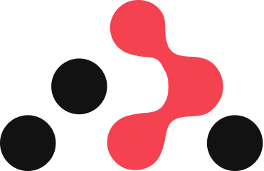
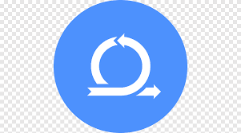
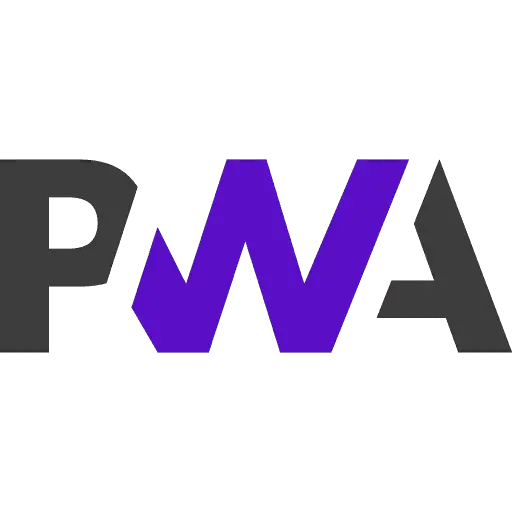

<!--
**fc79/fc79** is a ✨ _special_ ✨ repository because its `README.md` (this file) appears on your GitHub profile.
Here are some ideas to get you started:
- 🔭 I’m currently working on ...
- 🌱 I’m currently learning ...
- 👯 I’m looking to collaborate on ...
- 🤔 I’m looking for help with ...
- 💬 Ask me about ...
- 📫 How to reach me: ...
- 😄 Pronouns: ...
- ⚡ Fun fact: ...
```diff
- text in red
+ text in green
! text in orange
# text in gray
@@ text in purple (and bold)@@
```
-->
<!-- Welcome Message -->
<h3 align="center">
   Welcome to fatemeh gholizadeh's github page.
  
</h3>
<!-- Typing Text -->
<p align="center">
  
</p>

## ⭐️ About me
<!-- details -->
<div> I am fatemeh gholizadeh, a Front-End developer (mostly React JS)
 I got my bachelor degree in Iran University Of Science And Technology
 I have been learning React JS since 2020 via university projects. 
 By the end of my bachelor period, I (in teams which were consisted of my classmates) could perform coding of four React JS projects (One of them was during my internship).
 Now I am working as a full time React JS developer and trying to level up my knowledge.
 I am very eager to learn more about web development technologies and become an expert.
  </div>
  
## ⚡ Skills
<!-- Web Development -->
<p align="center">
  <code></code>
  <code></code>
  <code></code>
  <code></code>
  <code></code>
  <code></code>
  <code></code>
  <code></code>
  <code></code>
  <code></code>
  <code></code>
  <code></code>
  <code></code>
  <code></code>
</p>

## ⭐️ Projects
### Front-end

<p align="center">
  <a href="https://github.com/fc79/Pioneer">
    
  </a>

  <a href="https://github.com/ali-sedaghi/TunePal">
    
  </a>

  <a href="https://github.com/ali-sedaghi/Ali-Sedaghi">
    
  </a>
</p>
